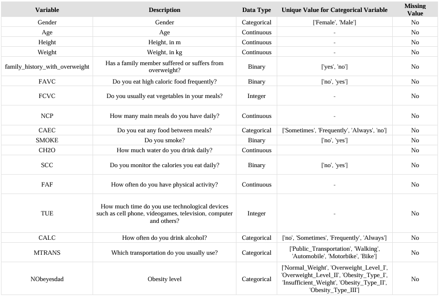
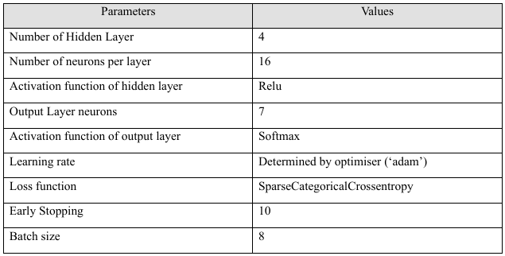
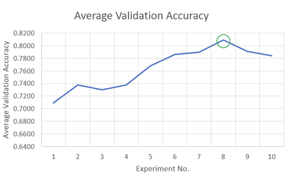
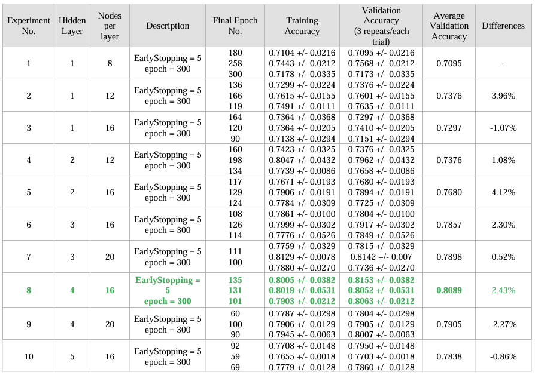
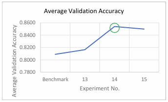
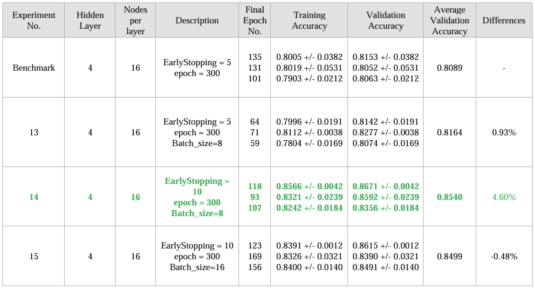
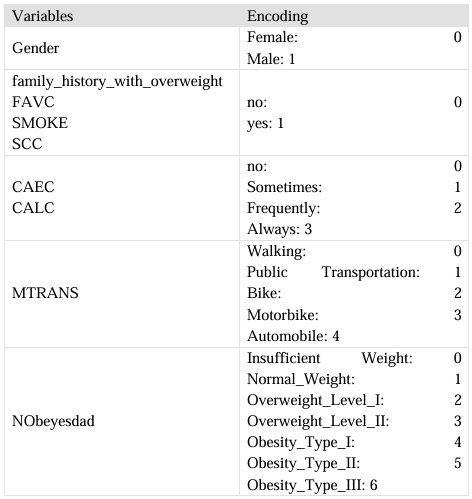
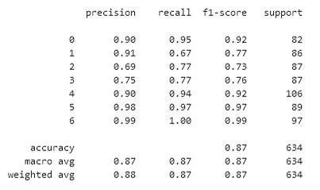

# Custom-Neural-Networks-Obesity-Level-Prediction

About:

This project is to build a classification prediction model to predict the classes of obesity based on the data of eating habits and physical conditions given as input.

### Dataset:
Details of the dataset selected for this application: 

**Name of dataset**: Estimation of Obesity Levels Based On Eating Habits and Physical Condition   
**Source**: UCI Machine Learning Repository 
(https://archive.ics.uci.edu/dataset/544/estimation+of+obesity+levels+based+on+eating+habits+and+physical+condition)   
**Instances**: 2111 rows, 17 columns    
**Description of dataset**: Based on the information given on the source, selected dataset consists of 2111 rows, where each row corresponds to the eating habit and physical condition of one individual from the countries of Mexico, Peru and Colombia.

---

### Task: 
To build a classification prediction model to predict the classes of obesity based on the data of eating habits and physical conditions given as input.  

**Input feature**: 16 features;   
feature name = [ Gender, Age, Height, Weight, family_history_with_overweight, FAVC, FCVC, NCP, CAEC, SMOKE, CH2O, SCC, FAF, TUE, CALC, MTRANS] 

**Target feature**: Obesity Level;   
classes = ['Normal_Weight', 'Overweight_Level_I', 'Overweight_Level_II', 'Obesity_Type_I', 'Insufficient_Weight', 'Obesity_Type_II', 'Obesity_Type_III']

## Model Development

Model used: **Multilayer Perceptron (MLP)** 
- MLP can learn high level and nonlinear patterns from the data.  
- Can be used solve a multi-class classification problem as well. 
- Able to reduce the extensive time-consuming manual feature engineering task. 

Table below shows the parameters defined in the model; justification will be discussed in the next section. 

**a. Hidden layer: **4** layers with **16** neurons per layer.**  
Activation function: relu  
Justification:
- For activation function, relu is selected as it is simple while able to avoid the vanishing gradient problem that slow down or stop the learning process. 
- For the number of hidden layer and neurons, they are selected based on the experiment to  determine the best combination of parameters by choosing the model that has the highest validation accuracy during training. 
- Refer to table below for the experiment log, strategy adopted as follow: 

**Experiment to search Optimal Parameter (Iterative Brute Force Search)**: 

- As a start, simple model is adopted by creating 1 hidden layer and nodes to be set half the number of features.   
- Then the model is trained to get it average maximum validation accuracy of training for a repeat of 3 times. Average of the average is computed as the final metric to compare between each model.   
- Next, continue to increase the number of nodes per layer slowly and if there is improvement on the validation accuracy. If minimal to no improvement observed, then increase the number of hidden layer and repeats the experiment.   
- At the same time, the epoch where the model stopped learning also being recorded to  monitor if the epoch is sufficient for model to learn.   
- As a result, hidden layer of 4 with neurons per layer of 16 (experiment no.8) is found  to be having highest average validation accuracy before it starts to degrade with neurons per layer of 20. (As shown in line chart below)    

Optimal Params (Hidden Layer):  

Experiment log:  

**b. Output Layer: 1 layer with 7 neurons; Activation function: softmax**  
Justification:

- In output layer, 7 neurons are set due to the number of classes to be predicted is 7 classes.  
- Softmax activation function is used for the purpose of multi-class classification task as it would 
be able to produce output as the probabilities for each class.  

**c. Learning rate: Utilise Adaptive Moment Estimation (adam)**  
Justification: 
- To save time and effort on experimenting, an optimizer is selected to adjust the learning rate 
dynamically based on the historical gradient magnitudes.  

**d. Loss function: Sparse Categorical Cross Entropy**  
Justification:
- As this is a multiclass classification problem, categorical cross entropy is selected as the loss 
function to minimise the difference between true and predicted distributions by penalizing 
incorrect predictions effectively. Sparse type is used to in the target variable, it is provided as 
integers instead of one-hot encoded vectors.   

**e. Batch_size = 8, Early_Stopping = 10**   
Justification: 
- To improve the model by enhancing the learning of model.

**Experiment to improve model (Iterative Brute Force Search)**: 
- After the optimal number of layers and neurons per layer are found, experiment was  done to enhance the training of the model. 
- Batch_size parameter was used in training to allow more weight updates of the model. 
- Early stopping criteria is added in training to preserve the resource of training and stopped automatically when there are 10 iterations with no significant improvement in 
its learning.   

Optimal Params (Early Stoping,Batch Size):  

Experiment log:  

## Code Execution
 Classification Steps  
These are the steps to be performed in classification  
Step 1: Data Cleaning  
Sanity checks on the data has been performed:
- Missing value: No missing values are found. 
- Inconsistent value: There is no inconsistency found in the categorical value. 
- Extreme value: No abnormal extreme value found in numerical variables.  

Step 2: Feature Engineering (Data Encoding)  
The categorical variables below are encoded to numerical values:

Step 3: Feature Selection  
In this study, all of the features will be selected as input to the prediction model. 

Step 4: Training & Test Dataset Split  
In this stage, the dataset will be split into training set and test set with test size 
of 30%. Train_test_split function from scikit-learn library is utilized for the data split. 
Stratify split is used and based on the target class to ensure the training and testing set 
has the similar class distribution. Training dataset will be used in model training, while 
testing dataset will be used in model evaluation.  

Step 5: Model Training  
In this stage, experiment to search for the optimal parameter for model and the 
enhance learning of model to be conducted. Detailed as discussed in section 3.0. After 
the model parameters are determined and fixed, a final training iteration of model will 
be conducted for 20 epochs. This is to get the best model out of the training, by saving 
the best model through enabling the ModelCheckpoint function from tensorflow keras.  

Step 6: Model Evaluation  
In this stage, the best model will be loaded and used to predict the input data, 
the testing dataset. Then, the accuracy score and classification report will be computed 
to quantify the performance of the prediction model.  

## Result 
The accuracy of this model measured using the test dataset is 87.22%. 
And the figure below shows the classification report of the prediction model.

Based on the classification report, class 0 ('Insufficient_Weight'), 4 ('Obesity_Type_I'),5 ('Obesity_Type_II') and 6 ('Obesity_Type_III') show a very good performance, with F1-scores above 0.90. There is room for improvement in terms of the class 1 ('Normal_Weight'), class 2 ('Overweight_Level_I') and 3 ('Overweight_Level_II').  Further investigation of the prediction on class 1,2,3 is required such as to conduct exploratory data analysis on the interaction between these 3 classes. There could be overlapping features or insufficient representation in the training data. 
